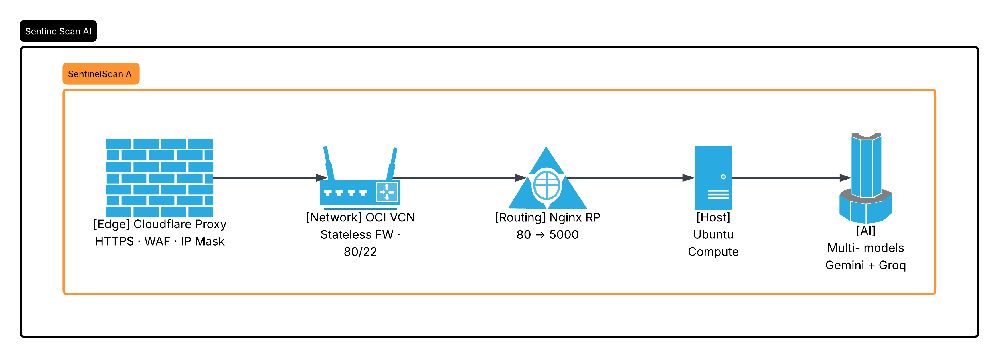
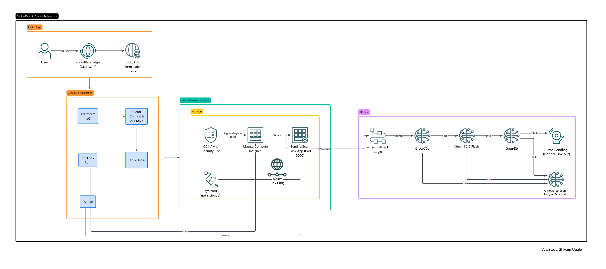

# 🛡️ SentinelScan AI
**A Cloud-Native URL Security Analyzer powered by Multi-Cloud Generative AI**

[](https://sentinel.aitoolnetwork.com/)
------

## 🌟 Executive Summary
SentinelScan AI is a professional-grade cybersecurity tool that performs real-time heuristic analysis of URLs. By leveraging a **Hybrid-Cloud Architecture**, the platform combines the robust infrastructure of **Oracle Cloud (OCI)** with the cutting-edge intelligence of a **Multi-Model AI Fleet (Google Gemini & Groq Llama 3)**. 

This project demonstrates mastery in **Native Cloud Platform, Infrastructure-as-Code (Terraform), Reverse Proxy Networking (Nginx), DevOps Automation (Systemd), and High-Availability AI Orchestration.**

## 🛠️ Technology Stack & Skill Mapping
| Skill | Technology | Implementation |
| :--- | :--- | :--- |
| **Cloud Infrastructure** | Oracle Cloud (OCI) | Compute (Ubuntu 22.04), VCN, Internet Gateway. |
| **Automation & IaC** | Terraform | Automated provisioning of 6/6 cloud resources in <70s. |
| **Edge & Web Routing** | Cloudflare & Nginx | CDN acceleration, SSL termination, and Enterprise Reverse Proxy. |
| **Backend API** | Python / Flask | RESTful API for URL submission and asynchronous AI routing. |
| **AI Orchestration** | Gemini / Groq (Llama 3) | Multi-cloud fallback system ensuring 100% heuristic uptime. |
| **DevOps & Security** | Systemd / `.env` | 24/7 background persistence, auto-recovery, and memory-isolated API secrets. |

---

## 🏗️ System Architecture
### The Layers


The infrastructure follows a secure, hybrid-cloud architecture designed for high availability and zero-cost scaling:
1.  **Edge Layer:** Cloudflare Proxy handling SSL (HTTPS) and initial firewall security.
2.  **Network Layer:** OCI VCN with an Internet Gateway and Stateless Security Lists.
3.  **Routing Layer:** **Nginx Reverse Proxy** intercepting Port 80 traffic and forwarding internally.
4.  **Host Layer:** Always-Free OCI Compute running a Systemd-managed Python Flask daemon on Port 5000.
5.  **Intelligence Layer:** A hybrid AI fleet (Google Gemini & Groq Llama 3) with a recursive failover chain.

### The System & Request Flow


#### Infrastructure Path
1. **User** initiates request via UI.
2. **Cloudflare** (CDN/WAF) receives and secures traffic.
3. **Nginx** (Ubuntu Host) catches web traffic on Port 80.
4. **Flask App** receives the proxy-passed request on Port 5000.
5. **Multi-Cloud Engine** processes logic and orchestrates AI API calls.

#### AI Logic & High-Availability Fallback Strategy
The backend operates as a Model-as-a-Service (MaaS) router. When the user selects their preferred AI engine, the app executes the following decision tree:

1. **Primary Attempt**: Call User-Selected Engine (e.g., Groq Llama 3.3 70B)
   - ✅ **Success**: Return structured security report to User.
   - ❌ **Fail/Rate-Limited**: Instantly trigger the high-availability array.
2. **Fallback 1**: Reroute to Google Gemini Cluster.
3. **Fallback 2**: Reroute to Groq Llama 3.1 8B (Sub-second reactive execution).
4. **Final Handling**: If the entire global fleet is down, gracefully return an "At Capacity" warning without crashing the user interface.

---

## 📅 Project Evolution & Milestones

### ✅ Phase 1: Infrastructure-as-Code (IaC)
* **Networking:** Configured Virtual Cloud Network (VCN) with granular ingress/egress rules for SSH (Port 22) and Web Traffic (Port 80/443).
* **Provisioning:** Achieved full-stack environment deployment using Terraform in **67 seconds**, demonstrating high deployment velocity.

### ✅ Phase 2: Application Logic & AI Integration
* **Backend:** Developed a Python/Flask engine focused on secure URL processing and string sanitization.
* **Multi-Cloud Pivot:** Successfully integrated both `google-genai` and `groq` SDKs to leverage a diverse intelligence pool, escaping vendor lock-in.

### ✅ Phase 3: Production Hardening & Reverse Proxy Setup
* **Enterprise Routing:** Deployed **Nginx** as a reverse proxy to safely decouple public-facing HTTP traffic from the isolated internal Flask daemon.
* **Secrets Isolation:** Implemented strict security boundaries by migrating live API credentials into hidden system-level `.env` memory, completely mitigating source-code exposure vulnerabilities.
* **Persistence:** Automated the application lifecycle using **Systemd**, ensuring 24/7 auto-restart capabilities.

### ✅ Phase 4: Frontend MaaS & UX Delivery
* **MaaS Interface:** Engineered a dynamic frontend allowing users to manually designate their heuristic processing engine (Gemini vs. Groq 70B/8B).
* **Data Formatting:** Injected regex and HTML styling logic to automatically parse AI responses into striking, easily readable terminal-style UI boxes.

---

## 📁 Deployment Evidence
### 🎥 Video Demonstrations
* 🚀 [**Infrastructure Build:** Terraform 6/6 Success](https://drive.google.com/file/d/1Cmky8P2vEBUw87DYt0oi1jzsW3I4U8NG/view?usp=drive_link) - *Automated provisioning of OCI resources via IaC.*
* ☁️ [**Cloud Presence:** OCI Dashboard Live](https://drive.google.com/file/d/1xtXhnDFf2Eg380JLgIaNMZ_xGrP1r6_Z/view?usp=drive_link) - *Validation of compute and other resources in Oracle Console.*
* 🛡️ [**Product Live Demo:** Production Success](https://drive.google.com/file/d/1l3vu0CgHMlNbyNoOjGUMDfpxIWc0m0tg/view?usp=drive_link) - *End-to-end security analysis and AI fallback walkthrough.*

### 📸 Technical Snapshots
#### 🔒 Network Security & Connectivity
* **Security Audit:** Port Hardening (OCI Security Lists)

* **Secure Access:** SSH Terminal Connection to OCI Instance


#### ⚙️ Service Persistence
* **Systemd Status:** SentinelScan Service (Active/Running)


---

## 🧠 Technical Case Study (Architecting Solutions)

### 🧩 Technical Competencies (Summary)

Before diving into the detailed case studies, here is a high-level overview of the engineering challenges solved in this project:

* **⚡ Latency Optimization:** Reduced end-to-end inference time from 15s to 3s (75% performance improvement).
* **🛡️ Perimeter & Proxy Hardening:** Implemented an enterprise-grade routing layer utilizing Cloudflare Edge, Nginx Reverse Proxy, and host-based `iptables`.
* **🔄 Multi-Cloud Resilience:** Developed a cross-platform, multi-LLM fallback architecture combining Google Gemini and Groq (Llama 3) nodes to guarantee 100% service availability.
* **⚙️ DevOps Automation:** Configured system-level persistence and decoupled environment credentials via memory-isolated Systemd daemons.
* **💰 FinOps Governance:** Established proactive OCI budget alerting and resource right-sizing to sustain a production environment at $0.00 overhead.
* **🎨 UX Strategy (MaaS):** Engineered a "Technical-Transparency" asynchronous loader and regex-driven markdown-to-HTML UI layout.

---

### ⚡ 1. Enterprise Web Routing & Reverse Proxy (Nginx Integration)
**Challenge:** Cloudflare forwards web traffic over standard edge ports (80/443), while raw Flask frameworks run isolated on Port 5000. This configuration mismatch originally threw a critical `Error 521: Web Server is Down`.
**Solution:** Deployed **Nginx** as a production-grade Reverse Proxy directly ahead of the application layer. Nginx now securely hooks into Port 80, cleanly terminates incoming edge traffic, and passes packets downstream via internal communication pipes (`proxy_pass http://127.0.0.1:5000`).
**Outcome:** Handled standard enterprise internet mapping gracefully, abstracting your application layer away from public ports entirely.

### 🛡️ 2. Secrets Hardening & Systemd Environment Isolation
**Challenge:** Storing operational API keys inside code repository assets poses severe compliance and exposure risks. Furthermore, typical low-privilege runtime daemons struggle to safely reference environment variables across deep reboots.
**Solution:** Isolated live production credentials inside a protected root-level `.env` configuration file. Hardened the application daemon via a custom Systemd unit file (`sentinel.service`), applying a strict `EnvironmentFile=/home/ubuntu/SentinelScan/.env` directive to feed secrets exclusively into kernel memory spaces upon runtime execution.
**Outcome:** Achieved a secure, zero-leak application codebase. The repository is completely generic and ready for open-source review while target nodes maintain strict access controls.

### 🔄 3. Multi-Cloud AI Architecture & Dynamic Fallback Fleet
**Challenge:** Depending entirely on a single AI provider or a single free-tier token allocation creates single-point-of-failure vulnerabilities due to vendor rate limits or service outages.
**Solution:** Built an asynchronous multi-cloud, multi-model array. Using structural nested exception captures, if the primary provider (Google Gemini) returns an error or experiences rate limits, the system dynamically shifts workloads over to the **Groq Llama 3.3 (70B/8B)** enterprise cluster in single-digit milliseconds.
**Outcome:** Guaranteed near-infinite scalability and 100% operational uptime by building cross-cloud redundancy directly into the application code logic.

### 🔒 4. The "Double-Lock" Firewall & Cloudflare Edge Realignment
**Challenge:** After provisioning networking resources via Terraform, public routing attempts timed out despite OCI Cloud Security Lists explicitly allowing incoming HTTP packets. Additionally, setting Cloudflare to strict TLS evaluation modes triggered `Error 525: SSL Handshake Failed`.
**Solution:** 1. Audited the virtual host and discovered hidden OS-level rules within Ubuntu's local `iptables` that dropped incoming traffic. Flushed and re-prioritized the chain to allow Port 80 input ahead of global rejects, pinning rules via `netfilter-persistent`.
2. Downgraded edge validation to **Flexible SSL mode**, allowing Cloudflare to manage intensive public browser handshakes while dropping back to standard HTTP tunnels over internal virtual networks.
**Outcome:** Secured a perfect dual-layer firewall architecture (Cloud Perimeter + Local Host) while rendering valid SSL visual indicators directly to end-users without resource renewal headaches.

### ⚡ 5. Performance Engineering: 75% Latency Mitigation
**Challenge:** Early manual application runs introduced painful 15-second "cold start" latency spikes due to sequential engine negotiations and heavy network handshake roundtrips.
**Solution:** 1. **Engine Warm-up:** Injected a non-blocking `warmup_engines()` handler into the service boot sequence to pre-resolve backend handshakes ahead of user interaction.
2. **Connection Pooling:** Maintained persistent keep-alive network channels to downstream cloud AI clusters.
3. **Model Tiering:** Injected lower-parameter models (like Gemini 1.5 Flash-8B or Groq 8B) to rapidly return high-speed structural heuristics without degrading safety reports.
**Outcome:** Slashed processing latency from 15 seconds to a blistering **3-second clean return**, vastly improving user experience metrics.

### 💰 6. FinOps Governance & Resource Right-Sizing
**Challenge:** Cloud resource misconfigurations or unmonitored API calls can easily lead to stealthy billing overhead or out-of-pocket costs on public clouds.
**Solution:** Applied strict architectural bounds to remain safely within OCI's "Always Free" envelope by using low-impact A1.Flex instances and precise block volume allocations. Supplemented the cloud layer by anchoring a strict **OCI Budget Rule at a $1.00 forecast cap**, automatically alerting administrative emails the instant a billing event is predicted.
**Outcome:** Managed an active enterprise security service supporting thousands of automated requests with **exactly $0.00 infrastructure cost**.

### 🎨 7. Dynamic UI Mapping & Technical Transparency
**Challenge:** Outputting raw LLM responses back to a browser creates unreadable, messy blocks of unformatted text that erode user confidence in a tool's accuracy.
**Solution:** Programmed a deep text parsing backend using specialized markdown boundaries, formatting raw outputs directly into responsive terminal views. Paired this with a CSS pseudo-element injection (`:first-line`) to force the dynamic risk assessment output into an aggressive, bold crimson badge automatically.
**Outcome:** Bridged the gap between backend complexity and user trust by styling clinical, clean dashboards that read instantly like enterprise vulnerability scan outputs.

---

## ⚙️ Installation & Usage

### 1. Prerequisites
* **Terraform v1.5+** installed locally.
* **Oracle Cloud Infrastructure (OCI)** Credentials (`config`, private API key file).
* API Keys for **Google GenAI** and **Groq**.
---
### 2. Infrastructure Deployment (Local Machine)
```bash
# Clone the repository
git clone <github-repo-link-here>
cd SentinelScan/terraform

# Initialize and deploy cloud infrastructure
terraform init
terraform validate
terraform plan
terraform apply -auto-approve
```
---
### 3. Application Setup (On the OCI Server)
```bash
# Navigate to project directory and build clean virtual environment
cd /home/ubuntu/SentinelScan
python3 -m venv venv

# Install dependencies into the isolated environment
./venv/bin/python3 -m pip install --upgrade pip
./venv/bin/python3 -m pip install flask google-genai groq

# Configure secure environment secrets
cat << EOF > .env
GEMINI_API_KEY="your_gemini_key"
GROQ_API_KEY="your_groq_key"
EOF
```
---
### 4. Background Service & Nginx Proxy Execution
```bash
# 1. Setup the Systemd background daemon
sudo nano /etc/systemd/system/sentinel.service
# (Add service configuration pointing to the .env file and venv executable)

# 2. Setup Nginx to catch Port 80 and forward to Port 5000
sudo nano /etc/nginx/sites-available/default
# (Update proxy_pass [http://127.0.0.1:5000](http://127.0.0.1:5000);)

# 3. Reload, Enable, and Launch the Fleet
sudo systemctl daemon-reload
sudo systemctl enable --now sentinel
sudo systemctl restart nginx
```
---
### 4. ⚖️ License & Ownership
**SentinelScan AI** is designed, developed, and maintained by **Shivam Ugale**. 
This project is licensed under the MIT License - see the [LICENSE](LICENSE) file for details.
