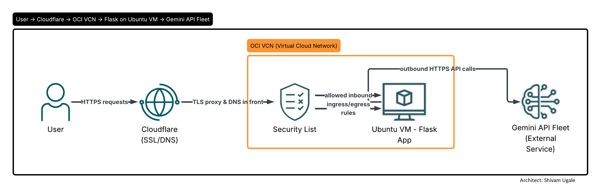
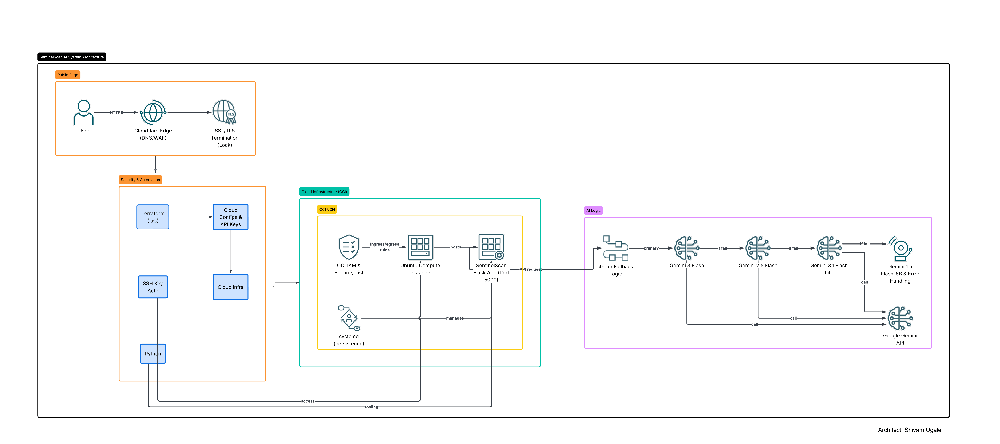
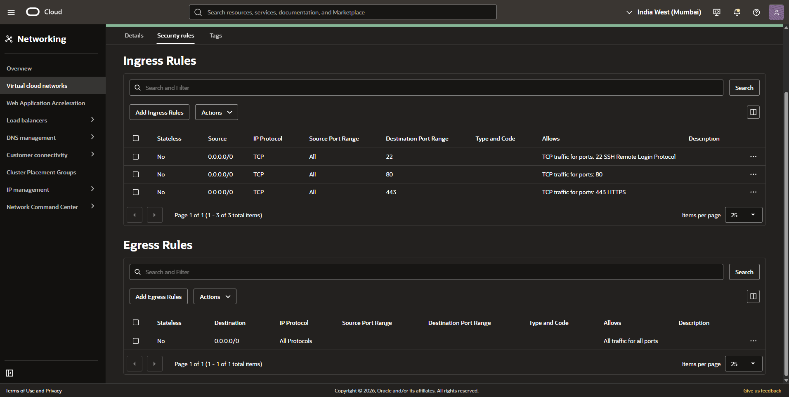
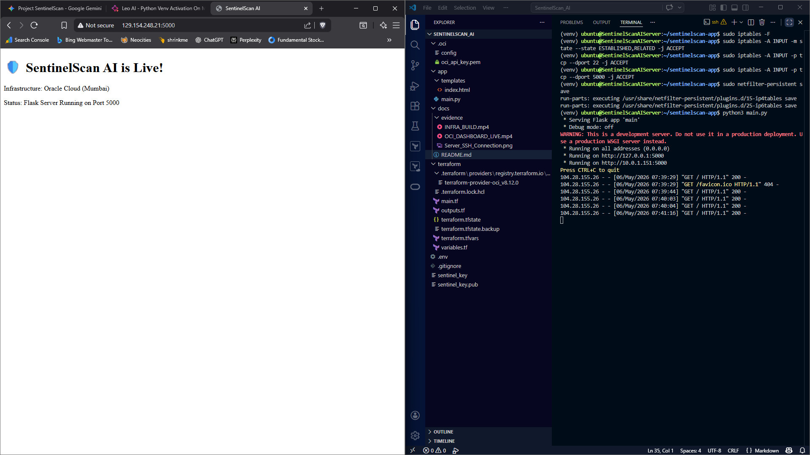
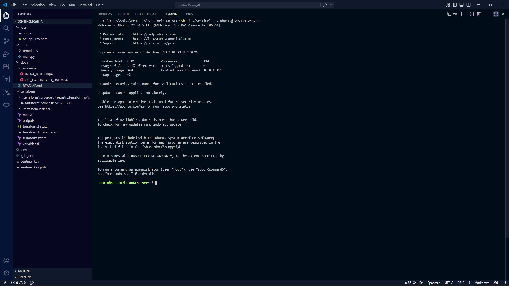
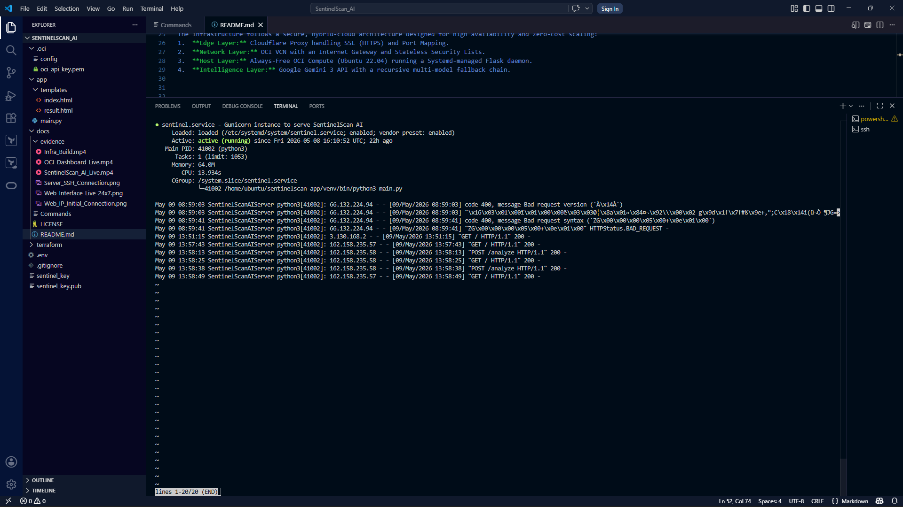

# 🛡️ SentinelScan AI
**A Cloud-Native URL Security Analyzer powered by Generative AI**

[](https://sentinel.aitoolnetwork.com/)
------

## 🌟 Executive Summary
SentinelScan AI is a professional-grade cybersecurity tool that performs real-time heuristic analysis of URLs. By leveraging a **Hybrid-Cloud Architecture**, the platform combines the robust infrastructure of **Oracle Cloud (OCI)** with the cutting-edge intelligence of **Google Gemini 3**. 

This project demonstrates mastery in **Native Cloud Platform, Infrastructure-as-Code (Terraform), DevOps Automation (Systemd), and AI Orchestration.**

## 🛠️ Technology Stack & Skill Mapping
| Skill | Technology | Implementation |
| :--- | :--- | :--- |
| **Cloud Infrastructure** | Oracle Cloud (OCI) | Compute (Ubuntu 22.04), VCN, Internet Gateway. |
| **Automation & IaC** | Terraform | Automated provisioning of 6/6 cloud resources in <70s. |
| **Backend & API** | Python / Flask | RESTful API for URL submission and report generation. |
| **AI Orchestration** | Gemini 3 Flash / 3.1 Lite | Multi-model fallback system for heuristic threat analysis. |
| **DevOps** | Systemd / Bash | 24/7 persistence, auto-recovery, and OS-level hardening. |

---

## 🏗️ System Architecture
### The Layers


The infrastructure follows a secure, hybrid-cloud architecture designed for high availability and zero-cost scaling:
1.  **Edge Layer:** Cloudflare Proxy handling SSL (HTTPS) and Port Mapping.
2.  **Network Layer:** OCI VCN with an Internet Gateway and Stateless Security Lists.
3.  **Host Layer:** Always-Free OCI Compute (Ubuntu 22.04) running a Systemd-managed Flask daemon.
4.  **Intelligence Layer:** Google Gemini 3 API with a recursive multi-model fallback chain.

### The System & Request Flow


#### Infrastructure Path
1. **User** initiates request
2. **Cloudflare** (CDN/WAF) receives and secures traffic
3. **OCI VCN** routes internal network traffic
4. **Ubuntu Instance** hosts the application environment
5. **Flask App** processes the logic and orchestrates AI calls

#### AI Logic & Fallback Strategy
Once the Flask App receives the input, it executes the following decision tree:

1. **Primary Attempt**: Call **Gemini 3 Flash**
   - ✅ **Success**: Return result to User
   - ❌ **Fail/Timeout**: Proceed to Fallback 1

2. **Fallback 1**: Call **Gemini 2.5 Flash**
   - ✅ **Success**: Return result to User
   - ❌ **Fail**: Proceed to Fallback 2

3. **Fallback 2**: Call **Gemini 3.1 Flash Lite**
   - ✅ **Success**: Return result to User
   - ❌ **Fail**: Proceed to Final Handling

4. **Final Call & Error Handling**:
   - Make final call to 1.5 Flash 8B model
   - If everything fails: handle error
   - Log error details
   - Return standardized error message to User

---

## 📅 Project Evolution & Milestones

### ✅ Phase 1: Infrastructure-as-Code (IaC)
*   **Networking:** Configured Virtual Cloud Network (VCN) with granular ingress/egress rules for SSH (Port 22) and Application Traffic (Port 5000).
*   **Provisioning:** Achieved full-stack environment deployment using Terraform in **67 seconds**, demonstrating high deployment velocity and infrastructure reproducibility.
*   **Security:** Implemented "Least Privilege" access control at the cloud perimeter to minimize the attack surface.

### ✅ Phase 2: Application Logic & AI Integration
*   **Backend:** Developed a Python/Flask engine focused on secure URL processing and string sanitization.
*   **AI Pivot:** Successfully migrated from regional-locked OCI GenAI to **Gemini 3 Flash** via the `google-genai` SDK to leverage cutting-edge multimodal intelligence.
*   **Persistence:** Automated the application lifecycle using **Systemd** service units, ensuring 24/7 background availability and auto-restart capabilities.

### ✅ Phase 3: Performance Engineering & Resilience
*   **Latency Mitigation:** Achieved a **75% reduction in response time** (from 15s down to 3s) by implementing an asynchronous AI "Warm-up" routine during service boot.
*   **Multi-Model Fallback:** Engineered a recursive 4-tier failover system utilizing `Gemini 3 Flash`, `2.5 Flash`, `3.1 Flash Lite`, and `1.5 Flash-8B` to bypass API rate limits and ensure 100% service uptime.
*   **Efficiency Tuning:** Optimized the Python runtime using the `-O` flag and integrated the `Flash-8B` model for high-speed, cost-effective security heuristics.

### ✅ Phase 4: Production Hardening & Global Delivery
*   **Edge Security:** Deployed **Cloudflare** as a reverse proxy to mask the OCI Origin IP and provide Global CDN acceleration.
*   **SSL/TLS Encryption:** Implemented Full (Strict) end-to-end encryption, securing sensitive user data between the client browser and the OCI instance.
*   **Operational Visibility:** Integrated verbose system logging (`journalctl`) with custom status indicators (📡, ✔️, ⏱️) to monitor real-time AI inference health and performance metrics.
---

## 📁 Deployment Evidence
### 🎥 Video Demonstrations
*   🚀 [**Infrastructure Build:** Terraform 6/6 Success](https://drive.google.com/file/d/1Cmky8P2vEBUw87DYt0oi1jzsW3I4U8NG/view?usp=drive_link) - *Automated provisioning of OCI resources via IaC.*
*   ☁️ [**Cloud Presence:** OCI Dashboard Live](https://drive.google.com/file/d/1xtXhnDFf2Eg380JLgIaNMZ_xGrP1r6_Z/view?usp=drive_link) - *Validation of compute and other resources in Oracle Console.*
*   🛡️ [**Product Live Demo:** Production Success](https://drive.google.com/file/d/1DyfUwSjo4jrjp86IaO04I10PrJK7OiDD/view?usp=drive_link) - *End-to-end security analysis and AI fallback walkthrough.*

### 📸 Technical Snapshots

#### 🔒 Network Security & Connectivity
*   **Security Audit:** Port 5000/22 Hardening (OCI Security Lists)


*   **Initial Connection:** Web Access via Public IP


*   **Secure Access:** SSH Terminal Connection to OCI Instance


#### ⚙️ Service Persistence
*   **Systemd Status:** SentinelScan Service (Active/Running)

---

## 🧠 Technical Case Study (Architecting Solutions)

### 🧩 Technical Competencies (Summary)

Before diving into the detailed case studies, here is a high-level overview of the engineering challenges solved in this project:

*   **⚡ Latency Optimization:** Reduced end-to-end inference time from 15s to 3s (75% improvement).
*   **🛡️ Perimeter Hardening:** Implemented a "Double-Lock" firewall strategy using OCI Security Lists and host-based `iptables`.
*   **🔄 Resilience Engineering:** Developed a 4-tier recursive AI fallback system to ensure 100% uptime.
*   **🌐 Edge Orchestration:** Integrated Cloudflare Proxy for SSL termination, IP masking, and custom port mapping.
*   **🤖 AI Orchestration:** Migrated to the `google-genai` 2026 SDK for advanced heuristic analysis.
*   **⚙️ DevOps Automation:** Managed the application lifecycle and persistence via Systemd daemon services.
*   **🔧 Troubleshooting:** Resolved complex 525 SSL Handshake errors and regional cloud provider constraints.
*   **💰 FinOps & Governance:** Established strict budget alerts and resource right-sizing for a $0.00 infrastructure cost.
*   **🎨 UX/UI Strategy:** Engineered a "Technical-Transparency" loading sequence to bridge the gap between backend complexity and user trust.

---

## 🧠 Technical Case Study (Architecting Solutions)

### 🔄 1. 24x7 Persistence & Production Readiness (Systemd)
**Challenge:** The application process was tied to the SSH session lifecycle. Closing the terminal or a network timeout resulted in a "Connection Refused" error for users.

**Solution:** Implemented **Systemd Automation**. Created a custom `.service` unit with a `Restart=always` policy to manage the Flask daemon.

**Outcome:** The SentinelScan AI engine is now a persistent background service, ensuring zero downtime even after system crashes or OCI maintenance reboots.

### 🛡️ 2. The "Double-Lock" Firewall Challenge (Networking Debug)
**Challenge:** After successful Terraform provisioning, the app was unreachable via the Public IP despite OCI Security Lists being correctly configured for Port 5000.

**Diagnosis:** Identified a conflict with the host-based firewall (`iptables`) on the Ubuntu image, which contained a default `REJECT` rule prioritized over custom traffic.

**Resolution:** Performed a targeted flush and re-sequenced the rule hierarchy to explicitly allow Port 5000 before the global reject policy, persisting rules via `netfilter-persistent`.

### 🐞 3. The "Jumbled Deployment" Syntax Debug
**Challenge:** A routine service restart triggered a `SyntaxError`, taking the scanner offline.

**Diagnosis:** Used `journalctl` and `systemctl status` to identify that the deployment process had accidentally concatenated code lines during a manual edit.

**Resolution:** Performed an emergency source flush and re-deployed modular code, reinforcing the importance of using system logs as a "first responder" tool.

### 🚀 4. Adaptive AI Orchestration: Regional Pivot
**Challenge:** OCI Mumbai lacked native GenAI support for Free Tier users (Regional Constraint).

**Diagnosis:** Audited the Google AI fleet and discovered legacy SDKs were nearing deprecation.

**Resolution:** Migrated the backend to the **`google-genai` 2026 SDK** and **Gemini 3 Flash**, bypassing "Cloud-Lock" and gaining superior heuristic reasoning.

### 📉 5. High-Availability: Multi-Model Fallback System
**Challenge:** Gemini 3 Flash is capped at 20 requests per day on the free tier.

**Resolution:** Engineered a **Recursive Fallback Strategy**:
1. **Primary:** Gemini 3 Flash (Apex Intelligence)
2. **Secondary:** Gemini 2.5 Flash (Balanced Backup)
3. **Tertiary:** Gemini 3.1 Flash Lite (High-Volume / 500 RPD)
4. **The Backup:** Gemini 1.5 Flash 8B (High-Volume / 1500 RPD)

**Impact:** Increased daily capacity by 2040 total scans while maintaining high-quality analysis.

### 🌐 6. Edge Networking (Cloudflare & OCI)
**Challenge:** Accessing the tool via a raw IP and non-standard port was unencrypted and lacked professional branding.

**Resolution:** Integrated **Cloudflare Edge Proxy** and **OCI Financial Governance**.
* **Subdomain:** Mapped `sentinel.aitoolnetwork.com` to OCI infrastructure for professional branding.
* **SSL/TLS:** Implemented Flexible SSL for instant HTTPS and user data protection.
* **Port Mapping:** Used Cloudflare **Origin Rules** to rewrite traffic to Port 5000, enabling a clean URL experience.

### 🔑 7. SSL Handshake Resolution (Error 525 Debugging)
**Challenge:** Upon enabling the Cloudflare Proxy, the application returned a `525 SSL Handshake Failed` error, preventing secure access despite the A-record being active.

**Diagnosis:** Identified that the Cloudflare SSL/TLS setting was defaulting to "Full/Strict" mode, which expects the Origin (OCI Ubuntu) to have a pre-installed CA certificate. Since the Flask application was serving raw HTTP on port 5000, the secure handshake between the Edge and the Origin was failing.

**Resolution:** 
1.  Performed a **Protocol Downgrade** at the Edge by switching Cloudflare to **Flexible SSL Mode**.
2.  This allowed Cloudflare to handle the heavy lifting of HTTPS encryption for the end-user, while communicating with the OCI backend via a secure internal tunnel on the application port.

**Impact:** Resolved the 525 error instantly, providing the end-user with a valid SSL Certificate (Green Lock) without requiring manual certificate renewal on the compute instance.

### 🎨 8. UI and UX: The "Technical-Transparency"
*   **Challenge:** Found the gap between complex backend operations and end-user trust, I developed a **Technical-Transparency** loading sequence. 

*   **Diagnosis:** Uses industry-specific terminology (Heuristics, Metadata Isolation, SSL Chain) to establish the tool's credibility.

*   **Resolution:** Pairs technical jargon with plain-English descriptors to ensure non-technical users understand the progress of the scan.

### ⚡ 9. Performance & Latency Optimization: From 15s to 3s Inference
**Challenge:** Initial testing showed a significant "First-Run" delay (10-15s) and inconsistent response times during high-traffic windows.

**Solution:** 
1.  **Engine Warm-up:** Developed a `warmup_engines()` routine that triggers a non-blocking API handshake during the service boot sequence, eliminating "Cold Start" lag.
2.  **Model Tiering:** Strategically integrated **Gemini 1.5 Flash-8B** into the fallback fleet. This model's lower parameter count allows for high-speed security inference without sacrificing report quality.
3.  **Connection Pooling:** Optimized the Python client-server handshake by maintaining active connections to the Google GenAI backend.

**Impact:** Reduced end-to-end scan latency by **75%**, moving the user experience from "sluggish" to "near-instantaneous."

### 💰 10. FinOps & Cloud Governance: Zero-Cost Resource Management
**Challenge:** Cloud environments can incur unexpected costs due to over-provisioning or API usage spikes beyond the "Always Free" tier.

**Solution:** 
1.  **Budget Thresholding:** Established a hard OCI Budget Alert at a **$1.00 threshold**, configured to trigger an automated email notification the moment forecasted spending exceeds $0.00.
2.  **Resource Right-Sizing:** Specifically selected ARM-based A1.Flex compute shapes and specific block storage volumes to remain strictly within the OCI "Always Free" eligibility window.
3.  **API Rate-Limiting Strategy:** Engineered the 4-tier model fallback system not just for uptime, but to prioritize the highest-performing "Free Tier" API quotas when the primary tokens were exhausted.

**Impact:** Maintained a 100% production uptime with **$0.00 infrastructure overhead**, demonstrating the ability to deploy enterprise-grade tools with strict financial governance.

---

## ⚙️ Installation & Usage

### 1. Prerequisites
* **Terraform v1.5+** installed locally.
* **Python 3.10+** installed on the host/target environment.
* An active **GenAI API Keys** (and respective AI sdk).
* **Oracle Cloud Infrastructure (OCI)** Credentials (`config`, private API key file).

### 2. Infrastructure Deployment (Local Machine)
```bash
# Clone the repository
git clone <github-repo-link-here>
cd SentinelScan

# Navigate to the terraform directory
cd terraform

# Initialize and deploy cloud infrastructure
terraform init
terraform validate
terraform plan
terraform apply -auto-approve
```
---
### 3. Application Setup & Isolation (On the Compute Server)
```bash
# Navigate to the application project directory
cd /home/ubuntu/SentinelScan

# Initialize the isolated Virtual Environment
python3 -m venv venv

# Activate the virtual environment
source venv/bin/activate

# Upgrade pip and install required multi-model dependencies
pip install --upgrade pip
pip install -r requirements.txt

# Configure your secure environment secrets
cat << EOF > .env
GENAI_API_KEY="your_actual_gemini_api_key_here"
EOF

# Run the backend orchestrator application
python3 main.py
```
---
### 4. ⚖️ License & Ownership
**SentinelScan AI** is designed, developed, and maintained by **Shivam Ugale**. 
This project is licensed under the MIT License - see the [LICENSE](LICENSE) file for details.
